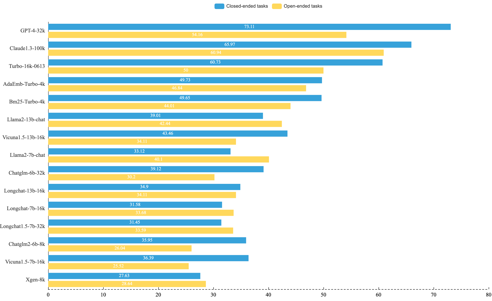
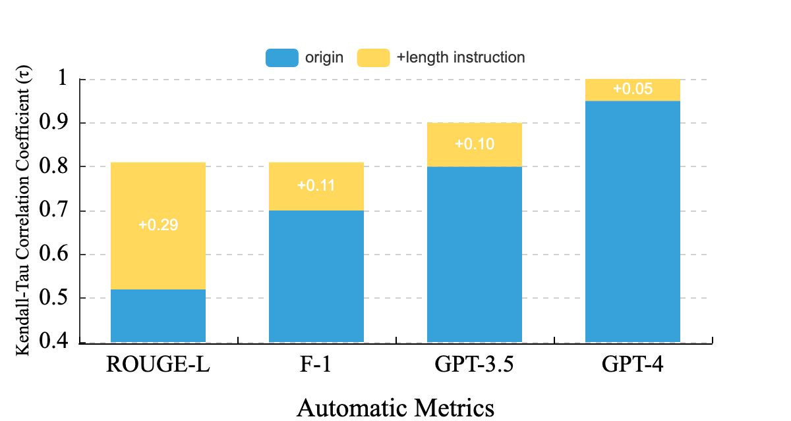
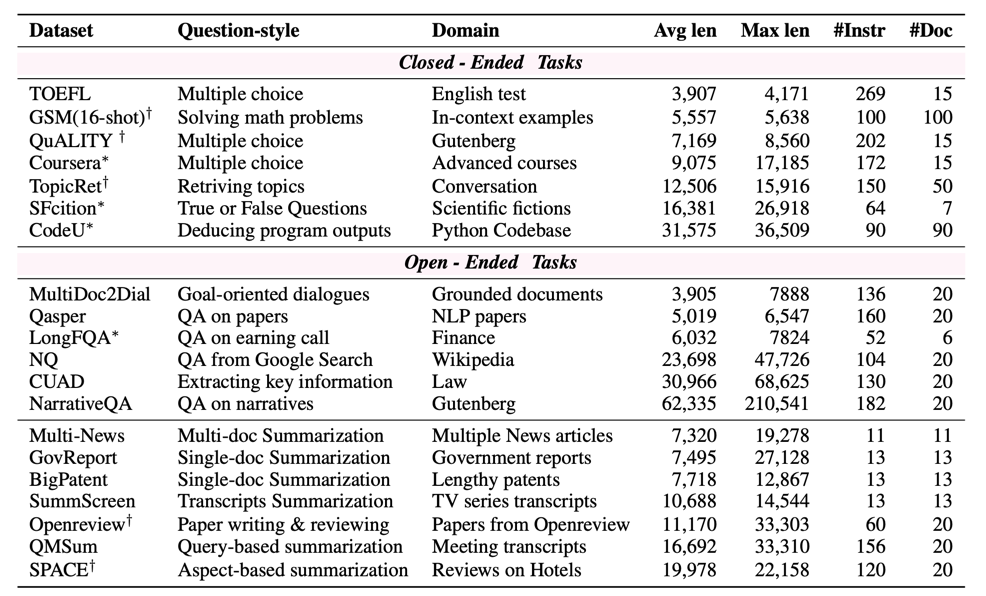
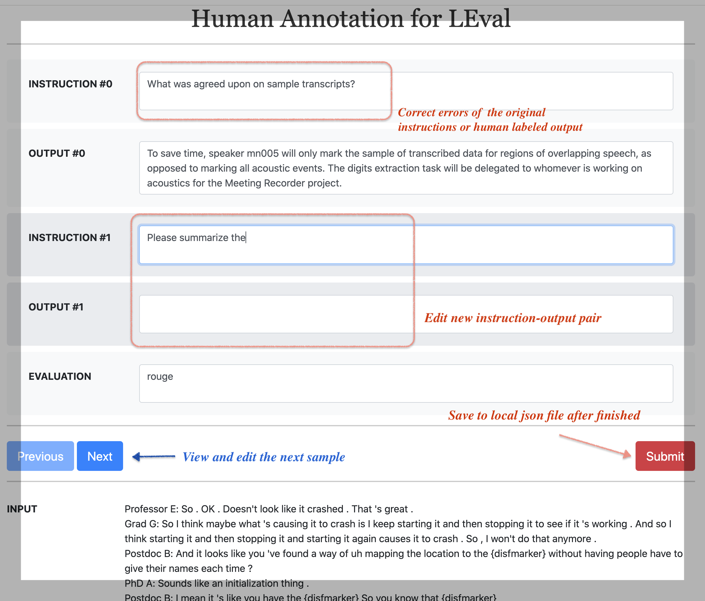
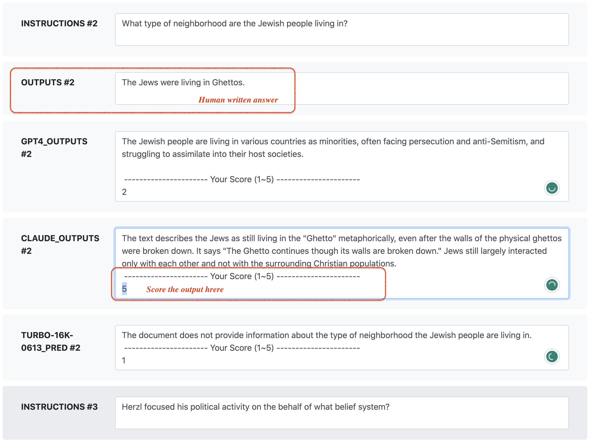
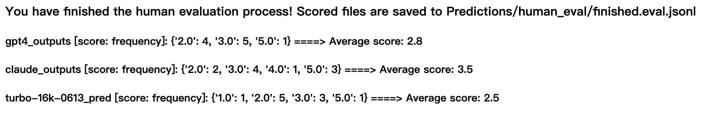

<div align="center">

</div>

------
### *L-Eval: Instituting Standardized Evaluation for Long Context Language Models*

**Data Collection:**   L-Eval ([preview on 🤗 HuggingFace Datasets](https://huggingface.co/datasets/L4NLP/LEval) • [check our 📃 paper](https://arxiv.org/abs/2307.11088) ) is a comprehensive Long Context Language Models (LCLMs) evaluation suite with 20 sub-tasks, 508 long documents, and over 2,000 human-labeled query-response pairs encompassing diverse question styles, domains, and input length (3k～200k tokens).
L-Eval has 2 groups: *closed-ended* tasks and *open-ended* tasks. The closed-ended group primarily tests the reasoning and understanding ability regarding a longer context, and the open-ended group consists of more summarization tasks that require aggregation of long document information ([download the data](#use)).

**Long Context LLMs Evaluation:**  Closed-ended tasks typically do not present issues with evaluation fairness. However, in real-world long-context tasks, open-ended tasks tend to be more common. We have found that *n-gram* metrics such as ROUGE and F1 cannot accurately reflect the abilities of LCLMs. As such, L-Eval does not solely rely on metrics used in previous text generation benchmarks. Instead, L-Eval primarily utilizes Length-Instruction-Enhanced (LIE) evaluation, and LLM judges (battling with Turbo-16k or Llama2). Please refer to [open-ended tasks evaluation](#eval)).

We hope L-Eval could help researchers and developers track the progress of long-context language models (LCLMs) and understand the strengths/shortcomings of different methods. We will also keep up with the **latest releases** of instruction-following LCLMs.

#### Other features of this repo:
- 🧭️ [Handle CUDA OOM with memory-efficient inference](#inference)
- 🖇️ [Build a retrieval-based baseline with Langchain](#tool)  
- ✏️ [Flask web client for editing local jsonl files](#tool)
- 🔖 [View the Leaderboard](https://l-eval.github.io) 
- 📨 [How to submit your results](#submit)  
- [Previous long sequence datasets used in L-Eval](#ack)  

#### Long context abilities of LLMs on closed/open-ended tasks:
<div align="center">

</div>

## 🔥 Updates of L-Eval 
- **[2024-4-25]** We add the results for Llama3 8b/70b.

| Model | TOEFL | QuALITY | Coursera | SFiction | GSM | CodeU |
|--------|------|------|-------|-------|-------|-------|
| [Llama3-8b-Instruct](https://huggingface.co/meta-llama/Meta-Llama-3-8B-Instruct)  | 82.89 | 64.85 |  53.77 | 69.53 |  79.00 | 2.22|
| [Llama3-70b-Instruct](https://huggingface.co/meta-llama/Meta-Llama-70B-Instruct) | 84.75 |80.19 | 75.87 | 72.65 |  90.00 |  6.67 | 
| GPT4-32k (2023) | 84.38 |82.17 | 75.58 | 74.99 |  96.00 |  25.55 | 

- **[2023-10-7]** Final version of our paper can be found [here](https://arxiv.org/abs/2307.11088).
- **[2023-8-30]** We have annotated two new closed-ended tasks:  (i) A [scientific fiction](https://github.com/OpenLMLab/LEval/blob/main/LEval-data/Closed-ended-tasks/sci_fi.jsonl) dataset to test the loyalty to input and (ii) a [code understanding](https://github.com/OpenLMLab/LEval/blob/main/LEval-data/Closed-ended-tasks/codeU.jsonl) dataset. 📢 **L-Eval** has been supported by [OpenCompass](https://github.com/internLM/OpenCompass/). You can  test L-Eval together with other benchmarks for foundation models here.

## Folders
The repository is structured as follows:

```bash
├── Baselines/ # scripts to generate the prediction files with baseline models
├── Baselines-light/ # scripts to generate the prediction files with 24G gpus
├── Evaluation/ # evaluation scripts
├── LEval-data/ # test samples
│   ├── Closed-ended-tasks/ # exact match tasks (like multiple-choice)
│   │   ├── test_file.jsonl 
│   │   └── ...
│   ├── Open-ended-tasks/ # generation tasks
│   │   ├── test_file.jsonl
│   │   └── ...
├── Predictions/ # output of models
│   ├── exam_eval/turbo-16k-0613
│   │              ├── <task_name>.pred.jsonl
│   │              └── ... 
│   ├── llm_gpt4_eval  
│   │             ├──<model_name>.pred.jsonl
│   ├── ngram_eval  
│   │             ├──model_name
│   │                     └──task_name.pred.jsonl
│   ├── ...
└── Tools/ # useful scripts

```
<a name="use"></a>
## Quick use
#### Step 1. Download the data 
It is easy to load the 20 test data in one line with huggingface datasets, and we give the example scripts:
```python
from datasets import load_dataset, disable_caching

datasets = ["coursera", "gsm100", "quality", "topic_retrieval_longchat", "tpo", "codeU", "sci_fi" ,"financial_qa", "gov_report_summ", "legal_contract_qa", "meeting_summ", "multidoc_qa", "narrative_qa", "natural_question", "news_summ", "paper_assistant", "patent_summ", "review_summ", "scientific_qa", "tv_show_summ"]
# The corresponding NAMEs in the paper
# "coursera", "GSM(16-shot)", "QuALITY", "TopicRet", "TOFEL", "codeU", "SFiction", "LongFQA", "GovReport", "CUAD", "QMSum", "MultiDoc2Dial", "NarrativeQA", "NQ", "Multi-news", "Openreview", "BigPatent", "SPACE", "Qasper", "SummScreen"]

for testset in datasets:
    # disable_caching()  uncomment this if you cannot download codeU and sci_fi 
    data = load_dataset('L4NLP/LEval', testset, split='test')
    # evaluate your model
```

You can also directly clone this repo:
```
git clone https://github.com/OpenLMLab/LEval.git
```
The test data is in [LEval-data](https://github.com/OpenLMLab/LEval/tree/main/LEval-data).

Each long document has multiple queries and corresponding responses. The format of each sample is as follows:
```json
{
    "instructions": ["What is the main goal of data science?\nA. Analyze and predict future trends\nB. Generate massive amounts of data\nC. Answer questions using data\nD. Increase the use of technology", "..."], // a list of instructions (questions need LLMs to answer)
    "outputs": ["C","A", "..."], // the ground truth or reference of corresponding instructions
    "input": "A very long document", // LLMs need to respond to instructions based on this long document.
    "source": "domain the document belongs to", // meeting, narrative_qa, etc.
    "evaluation": "Metrics used for evaluation" // e.g., exam, human, LLM, ROUGE, F1, etc.
}
```

#### Step 2. Generate your prediction results (Closed-ended tasks)
**Examples of closed-ended tasks**
  - Multiple Choice Question (single correct option). Example predicted answer: `A, BCD`
  - Math Word Problems. Example predicted answer: `3`

We test all the baselines with a single 80G A800 GPU. If you encounter the OOM problem, please refer to [multiple GPUs inference](#inference). To generate the output files, you need to add a new file to `Baseline` folder and then replace the model name with your own model. An example of testing `gpt3.5-turbo-16k` on closed-ended tasks:
```
python Baselines/turbo16k-test.py  --metric exam_eval (for closed-ended group)  --task_name quality [Optional, if you only want to test one task]
```
The script will save the prediction results to a local file. You need to press enter to confirm the path. Details about open-ended tasks can be found in the [next section](#eval).

#### Step 3. Evaluate the prediction file
Given the prediction file generated in Step 2, please run the following command to calculate the metric:
```
python Evaluation/auto_eval.py --pred_file Predictions/exam_eval/turbo-16k-0613/quality.pred.jsonl 
```


## Evaluating LCLMs on open-ended tasks
In this part, we mainly introduce how to evaluate LCLMs on open-ended tasks.

<a name="eval"></a>
#### Examples of open-ended tasks 
- Summarization. Example predicted answer: `This paper proposes a new method for ...`
- Abstractive question answering. Example predicted answer: `The main goal of data science is to answer questions using data.`

Generate prediction results on open-ended tasks:
```
CMD: python Baselines/turbo16k-test.py --metric ngram_eval (for open-ended group)  --task_name narrative_qa [Optional, if you only want to test one task]
```
Generate prediction results on the **96-question** subset (GPT-4 evaluation subset):
```
CMD: python Baselines/turbo16k-test.py --metric llm_gpt4_eval
```
Generate prediction results on the **85-question** subset (human evaluation subset):
```
CMD: python Baselines/turbo16k-test.py --metric human_eval 
```
Generate prediction results on the 2 subsets (181 questions) :
```
CMD: python Baselines/turbo16k-test.py --metric llm_turbo_eval 
```


#### Automatic Metrics
we use the following automatic metrics to evaluate the performance of generation tasks:
- **GPT-4/3.5** Evaluation. We suggest using GPT-4 as a judge and battling with `turbo-16k-0613`. We report the win-rate in our paper. Turbo-16k serves as a strong baseline, and you could also opt for `Llama2-4k` to directly demonstrate the extent of your improvements.
```
python Evaluation/llm_eval.py --pred_file Predictions/ngram_eval/vicuna-13b-16k/narrative_qa.pred.jsonl --judge_model gpt-4 (or gpt-3.5-turbo) --battle_with Predictions/ngram_eval/turbo-16k-0613 (or llama2-13b-chat)/narrative_qa.pred.jsonl
```
Please add the following judgment prompt in Long context settings:
> Additional details or information that are not mentioned in the reference answer cannot be considered as advantages and do not let them sway your judgment.

- **N-gram Match** Evaluation (biased), traditional automatic metrics like F1, ROUGE, is very cheap and efficient to calculate. However, they are biased towards the length of the predicted answer. 
```
python Evaluation/auto_eval.py --pred_file Predictions/ngram_eval/vicuna-13b-16k/narrative_qa.pred.jsonl
```
#### ❗ Length-Instruction-Enhanced Evaluation
For open-ended tasks,  models are informed of the ground truth length via a length instruction,e.g,  *We need a 20 words summary* where 20 is the length of reference answer to reduce the length bias in automatic metrics. The figure below shows the improvement in Kendall-Tau correlation with human assessment brought by length-instruction-enhanced evaluation.
<div align="center">

</div>

#### Human evaluation
we provide a very easy-to-use flask web app running on `localhost 127.0.0.1:5000`. You need to copy your prediction file `<model_name>.pred.jsonl` (samples with `evaluation: human`) to the `Predictions/human_eval` folder and then run:
```
python Evaluation/web_human_eval.py  --mode begin (or continue)
```
where `--mode` denotes whether you are starting a new evaluation or continuing your previous annotation.  Feel free to close the browser and set `--mode continue` to continue from your last annotation. Once running the script, you have to provide the annotator name and your annotation results will be saved to `Predictions/human_eval/annotation_from_<name>.jsonl`.
See the running screenshot [here](#human_demo). We  have provided the prediction files from 5 popular models as baselines for human evaluation. if you want to add outputs from other baselines, you can also move the corresponding prediction file to the `Predictions/human_eval` folder.

### Statistics of the data:
<div align="center">

</div>


<a name="submit"></a>
## How to Submit
The [leaderboard](https://l-eval.github.io) contains 5 parts: `Exact Match, GPT-4 evaluator, GPT-3.5 Evaluator, F1, ROUGE`,

To submit your results on our leaderboard, you can send an email to `levalbenchmark@gmail.com`. 
#### Your submission should include 4 things:

* Metadata: Model name, number of parameters, and links to your paper/blog/GitHub/demo.
* Output files: Please submit 1 folder named with your model (e.g., `Predictions/turbo-16k-0613` ) for ngram matching evaluation and a jsonl file, e.g., `Predictions/LLM_Eval/claude100k.pred.jsonl`(The file naming format is `model_name.pred.jsonl`) for  LLM evaluation, as described in [Evaluation scripts section](#eval).
* Results: Please submit the results produced by our evaluation scripts. Results should contain all keys in the  [leaderboard](https://l-eval.github.io).
* Judgements from turbo3.5 and gpt4 (The output file produced by `llm_eval.py`)

We will randomly verify some results with the submitted output files.

#### Explanation of keys in the leaderboard

1. Keys in [Exact Match](https://l-eval.github.io)
   - `Avg`:  averaging over 4 datasets performance score.
   - `Max-Ctx`: the maximum context length of your model.
   - `Tokens`: the number of input tokens in experiments.
   - `Ret.`: whether using retrieval.
   - `PE`: whether doing prompt engineering (e.g., modifying the original prompt to improve the performance,  providing in-context examples).
   - `IDD`: whether using in-domain data (e.g.  data from qmsum, narrative_qa training set) into further finetuning. **Please don't hack this evaluation set**. But considering most of the sources are open, if your dataset potentially contains some in-domain data, you don't need to remove them. In that case, please set this value to 'yes'. If the construction of the IFT data is not transparent, you can leave it blank.
2. Keys in [F1_and ROUGE](https://l-eval.github.io) 
   - `F1 avg`:  the average over each dataset’s overall F1 score on QA-style tasks
   - `ROUGE avg`: the average over each dataset’s overall ROUGE-L score on Summarization-style tasks.
   - `Length`: the average length of the generated outputs.
3. Keys in [GPT-4/3.5 Evaluator](https://l-eval.github.io)
    - `n_wins`: number of wins including results of swapping the position of two answers.
    - `n_draws` number of draws including results of swapping the position of two answers.
    - `win % vs turbo16k` The win rate of your model in the battle with `turbo-16k-0613`
    - `Length`: the average length of the generated outputs.

<a name="inference"></a>
## Memory-efficient inference and multiple GPUs inference
### Using Flash Attention during inference 🚀
Please first try [Flash Attention](https://github.com/Dao-AILab/flash-attention) if you have a **80G** GPU. Based on our experiments, it works well when the sequence length is less than 32k (Flash-attn v2).  if you still encounter OOM, please refer to the next section.
If you are using LLaMA, we support FlashAttention in inference which can save your gpu memory, please add the param `--flash`.  The code is similar for other models.
Flash attention for Chatglm is implemented with torch2.0. Please ensure that you have successfully installed it.

If you encounter installation issues, it's likely due to the CUDA and Torch versions mismatch. Here is my running env:
```
python>=3.8
torch==1.13.1+cu117
CUDA Driver Version: 525.105.17   CUDA Toolkit: 11.7
git clone https://github.com/Dao-AILab/flash-attention.git
cd flash-attention/
[if flashAttn-v1] git checkout tags/v1.0.0 
python setup.py install
```

```
python Baselines/longchat-test.py --task_path LEval-data/Open-ended-tasks/narrative.jsonl --max_length 16k --gpu 0 --metric ngram_eval --flash 
```

### Memory-efficient inference with [LightLLM](https://github.com/ModelTC/lightllm) 🚂

Using lightLLM can make the inference procedure on a single or multiple 24G GPUs by optimizing the storage of KV cache but sacrificing inference speed.

#### Installation
1. Download L-Eval and the [data](https://github.com/OpenLMLab/LEval#step-1-download-the-data).
2. Install LightLLM according to the [official instructions](https://github.com/ModelTC/lightllm#get-started).

#### Examples of running L-Eval with LightLLM
> You must first download the model you would like to evaluate. LightLLM does not support automatic downloads yet.

> Code for running L-Eval with LightLLM is located in the `Baselines-light` directory.

The following command evaluates vicuna-7b-v1.5-16k on 4 RTX 3090 GPUs.
```bash
python Baselines-lightllm/vicuna-test.py --metric exam_eval --max_length 16k --model_path /.../.../vicuna-7b-v1.5-16k/ --lightllm_extra_args "--tp 4 --max_total_token_num 130000 --trust_remote_code --max_req_total_len 16384 --max_req_input_len 15900"
```

> You don't actually need 4 GPUs to run this example. But performance will improve with more GPUs.

`--lightllm_extra_args` are extra arguments passed to LightLLM server. View the [LightLLM documentation](https://github.com/ModelTC/lightllm/blob/main/docs/ApiServerArgs.md) for more information on how to set these arguments. `model_dir` is automatically passed and do not need to be specified again.

The script assumes LightLLM server is listening on port `8000`.

#### Known Issues
LightLLM server process might not properly terminate after the evaluation script stops. If you don't have other Python processes running, you can run `killall -HUP python` to terminate LightLLM server.


## Other Tools
<a name="tool"></a>
### Using Langchain to build retrieval-based baselines
You can use the script `turbo4k-retrieve-test.py` in `Baselines` to enhance a regular LLM with a sparser or dense retriever. An example is as follows:
```
python Baselines/turbo4k-retrieve-test.py --metric exam_eval (or ngram_eval, human_eval, llm_turbo_eval, llm_gpt4_eval) --retriever BM25 (or AdaEmbedding)
```
The retrieval-based method is implemented with [langchain](https://github.com/hwchase17/langchain). If you want to use BM25 retriever, please first install [Elasticsearch](https://github.com/elastic/elasticsearch). If you want to try ada embedding (cheap but effective), please fill your api-key.
 

### A flask-based annotation website for jsonl files
We have also released a very easy-to-use annotation website for L-Eval and make sure you have installed flask.
Firstly, you have to preprocess your files into a jsonl format which should contains 3 keys `input:str`, `instructions:list` and, `outputs:list` (see the examples in `LEval-data` folder).
To annotate new instruction-output pairs, please run the script to view and annotate the local jsonl file:
Start running the website on `127.0.0.1:5000` by:
```
python Tools/web_annotate_jsonl.py --path LEval-data/Generation/meeting_summ.jsonl --mode begin --new_pairs_num 2
```
where `--new_pairs_num` means the number of new QA pairs you want to add and `--mode` (begin or continue) means whether you want to continue from previous annotation results. 
The input file denoted by `--path` should be a `jsonl` file like the examples in `LEval-data` folder.  In this case, we annotate two new QA pairs based on the long input. After clicking `submit`, the results will be saved to the disk.

#### Example of our annotation website
<div align="center">

</div>

<a name="human_demo"></a>
#### Example of the human evaluation website
<div align="center">

</div>
You can score the outputs from different models via the website. After completing the annotation, the result page is like:
<div align="center">

</div>

## Acknowledgement
<a name="ack"></a>
This work is done by Fudan University and The University of Hong Kong.
Primary contributors: Chenxin An, Shansan Gong, Ming Zhong, Xingjian zhao, Mukai Li, Jun Zhang, Lingpeng Kong, and Xipeng Qiu.

We would like to express our gratitude towards Siyu Ren, Zhiyong Wu, Qinyuan Cheng, Bo Wang, and Yukang Chen for their valuable suggestions and insights!

**We sincerely appreciate the assistance provided by the following works for L-Eval**:
- We download the videos to form the long documents from [Coursera website](https://www.coursera.org/)
- we extract 100 math problems from  [GSM8k](https://github.com/openai/grade-school-math) and we use 8 long examples from [{chain-of-thought-hub](https://github.com/FranxYao/chain-of-thought-hub/blob/main/gsm8k/lib_prompt/prompt_hardest.txt)
- topic retrieval data is collected from [LongChat](https://github.com/DachengLi1/LongChat)
- QuALITY is from [their official github](https://github.com/nyu-mll/quality)
- TOEFL Practice Online data comes from [TOEFL-QA](https://github.com/iamyuanchung/TOEFL-QA/tree/master) 
Other open-sourced datasets are collected from: [gov_report](https://gov-report-data.github.io/),  [cuad](https://github.com/TheAtticusProject/cuad), [qmsum](https://github.com/Yale-LILY/QMSum),  [Multidoc2dial](https://doc2dial.github.io/multidoc2dial)
 [narrativeQA](https://github.com/deepmind/narrativeqa), [Natural Questions](https://github.com/google-research-datasets/natural-questions), [review advisor](https://github.com/neulab/ReviewAdvisor), [multi-news](https://github.com/Alex-Fabbri/Multi-News)
[bigpatent](https://evasharma.github.io/bigpatent/), [SPACE](https://github.com/stangelid/qt), [Qasper](https://github.com/allenai/qasper-led-baseline), [SummScreen](https://github.com/mingdachen/SummScreen)

Please kindly cite the [original papers](https://github.com/OpenLMLab/LEval/blob/main/citation.bib) when using L-Eval.
Thanks again for their effort!!  

We are very pleased to answer any questions about L-Eval: `cxan20@fudan.edu.cn`

## Citation
```
@misc{an2023leval,
      title={L-Eval: Instituting Standardized Evaluation for Long Context Language Models}, 
      author={Chenxin An and Shansan Gong and Ming Zhong and Mukai Li and Jun Zhang and Lingpeng Kong and Xipeng Qiu},
      year={2023},
      eprint={2307.11088},
      archivePrefix={arXiv},
      primaryClass={cs.CL}
}
```


