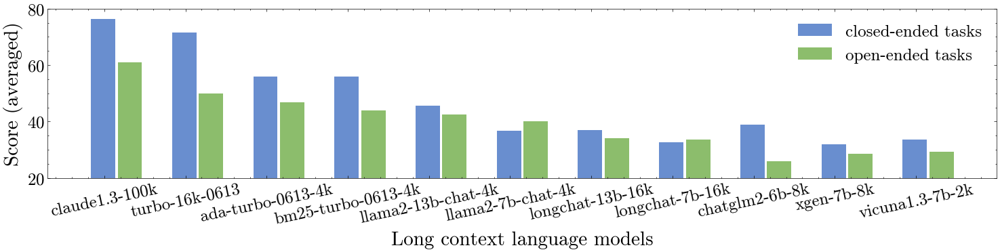

<div align="center">

</div>

------
### *L-Eval: Instituting Standardized Evaluation for Long Context Language Models*

L-Eval ([preview on 🤗 HuggingFace Datasets](https://huggingface.co/datasets/L4NLP/LEval) • [check our 📃 paper](https://arxiv.org/abs/2307.11088) ) is a comprehensive long-context language models evaluation suite with 18 long document tasks across multiple domains that require reasoning over long texts, including summarization, question answering, in-context learning with long CoT examples, topic retrieval, and paper writing assistance. L-Eval is a high-quality test set with  411 long documents and  2043 manually labeled query-response pairs.   
Currently, there have been great efforts invested in the expansion of context length for large language models. 
But it remains unclear whether extending the context can offer substantial gains over traditional methods such as retrieval, and to what extent it improves upon their regular (short context) counterparts  in practical downstream tasks. 

We hope L-Eval could help researchers and developers track the progress of long-context language models (LCLMs) and understand the strengths/shortcomings of different methods. We will also keep up with the **latest releases** of instruction-following LCLMs.

#### Features of this repo:
- 🧐 [How to get the data](#use)  
- 📏 [How to evaluate your models](#eval)  
- 📨 [How to submit your results](#submit)  
- 🔖 [View the Leaderboard](https://github.com/OpenLMLab/LEval/tree/main/Leaderboard)  
- 🖇️ [Build a retrieval-based baseline with Langchain](#tool)  
- 🧭️ [Memory-efficient inference and multiple GPUs inference](#inference)  
- ✏️ [Annotate & filter QA pairs with flask web app](#tool)

#### Overview:
<div align="center">

</div>


## Updates of L-Eval
- 2023.8.1  We've tested more models, including GPT4, vicuna, and Llama2-13B, and updated the results for Turbo-16k by incorporating length instructions to reduce length biases in open-ended tasks. The previously released Turbo-16k did not include this feature, and its performance was slightly lower than that of the current version. Please **replace** the turbo-16k predicted files with new files committed on 2023.8.1. We're sorry for the inconvenience.
- 2023.8.1  Predictions of LCLMs tested in this paper are available [here](https://drive.google.com/drive/folders/1pPbIXw0eRD_XZVMixZL4BG_SrMwFH3SH?usp=sharing) and judgements from gpt4 are available [here](https://drive.google.com/drive/folders/1bUGs-2isRLaY5xCz8k3mkKDArX6WxX0u?usp=sharing). 
We hope these can help researchers analyze different models and metrics. We also add a related work section discussing other long sequences benchmarks.  

Please check our paper [v2](https://arxiv.org/abs/2307.11088) for more details.

## Folders
The repository is structured as follows:

```bash
├── Baselines/ # scripts to generate the prediction files with baseline models
├── Evaluation/ # evaluation scripts
├── Leaderboard/ # csv files of results
├── LEval-data/ # test samples
│   ├── Exam/ # exact match tasks (like multiple-choice)
│   │   ├── test_file.jsonl 
│   │   └── ...
│   ├── Generation/ # generation tasks
│   │   ├── test_file.jsonl
│   │   └── ...
├── Predictions/ # output of models
│   ├── exam_eval/trubo-16k-0613
│   │              ├── <task_name>.pred.jsonl
│   │              └── ... 
│   ├── llm_gpt4_eval  
│   │             ├──<model_name>.pred.jsonl
│   ├── ...
├── Tools/ # useful scripts
├── figs/ # figures
├── LICENSE
└── README.md
```


## Quick use
#### Step 1. Download the data 
It is easy to load the test data in one line with huggingface datasets, and we give the example scripts:
```python
from datasets import load_dataset

datasets = ["coursera", "gsm100", "quality", "topic_retrieval_longchat", "tpo", "financial_qa", "gov_report_summ", "legal_contract_qa", "meeting_summ", "multidoc_qa", "narrative_qa", "natural_question", "news_summ", "paper_assistant", "patent_summ", "review_summ", "scientific_qa", "tv_show_summ"]

for testset in datasets:
    data = load_dataset('L4NLP/LEval', testset, split='test')
    # evaluate your model
```

You can also directly clone this repo:
```
git clone https://github.com/OpenLMLab/LEval.git
```
The test data is in `LEval-data`.

Each long document has multiple queries and corresponding responses. The format of each sample is as follows:
```json
{
    "instructions": ["What is the main goal of data science?\nA. Analyze and predict future trends\nB. Generate massive amounts of data\nC. Answer questions using data\nD. Increase the use of technology", "..."], // a list of instructions (questions need LLMs to answer)
    "outputs": ["C","A", "..."], // the ground truth or reference of corresponding instructions
    "input": "A very long document", // LLMs need to respond to instructions based on this long document.
    "source": "domain the document belongs to", // meeting, narrative_qa, etc.
    "evaluation": "Metrics used for evaluation" // e.g., exam, human, LLM, ROUGE, F1, etc.
}
```

#### Step 2. Generate your prediction files
We test all the baselines with a single 80G A800 GPU. If you encounter OOM problem, please refer to this [part](#inference)
To generate the output files, just modify one of the baseline scripts, e.g., `longchat-test.py/llama2-chat-test.py` which has the most similar input format with yours. Then replace the model name with your own model and run:
```
python Baselines/chatglm2-test.py --task_path LEval-data/Closed-ended-tasks/tpo.jsonl or (--task_name tpo)  --gpu 0 --metric ngram_eval (exam_eval, llm_eval, human_eval)
```
where `--metric` means which metric you want to use (e.g., we use `exam_eval` for closed-ended tasks). Details about metrics in L-Eval can be found in the next section. The script will print out the path to the prediction file and you need to press enter to confirm.
If you are using LLaMa, we also support FlashAttention in inference which can save your gpu memory, please add the param `--flash`.

#### Step 3. Evaluate the prediction file
Based on the `--metric` passed in Step 2, you can choose one of the scripts from `Evaluation/auto_eval.py`,  `Evaluation/llm_eval.py`, and `Evaluation/web_human_eval.py`. Then run the following command:
```
python Evaluation/auto_eval.py --pred_file Predictions/exam_eval/<your model>/coursera.pred.jsonl 
```
Examples of using the  `Evaluation/llm_eval.py`, and `Evaluation/web_human_eval.py` can be found [here](#eval_script)

<a name="eval"></a>
## How to Evaluate on L-Eval
In this part, we explain the metrics we used and how to run the evaluation scripts.

### Metrics used in L-Eval
L-Eval does not only contain open-ended questions (e.g.: multiple choice)  considering that in real-world applications, the generated answer  may not be exactly the same as the reference for long documents tasks. L-Eval is mainly divided into **two groups**: `Close-ended` and `Open-ended` and we use different evaluation metrics for each group.
#### Closed-ended tasks
  - Multiple Choice Question (single correct option). Example predicted answer: `A`
  - Multiple-Answer Questions (multiple correct options). Example predicted answer: `BCD`
  - Math Word Problems. Example predicted answer: `3`
  - Topic Retrieval. Example predicted answer: `The benefits of volunteering`
 
 The only evaluation metric used in these tasks takes the format of *Exact Match*  `"evaluation": "exam"` like grading exam papers.
 The total score is 100 and the score on each question is `100/(number of questions)`. For Multiple-Answer Questions, if the predicted answer does not cover all correct answers, it will only achieve a **quarter** of the score on this question. For example, if the correct answer is `ABC` and the predicted answer is `AC`, the score on this question is `0.25 * [100/(number of questions)]`.

#### Open-ended tasks 
- Summarization (Summarize a long document into a short paragraph). Example predicted answer: `This paper proposes a new method for ...`
- Abstractive Question Answering (Answer questions based on a long document). Example predicted answer: `The main goal of data science is to answer questions using data.`
- Writing Assistance (Assist in writing part of the long document). Example predicted answer: `2 Related Work\n Recent study has shown that ...`

we use the following metrics to evaluate the performance of generation tasks:
- *N-gram Match Evaluation*,  `"evaluation": "f1" or "rouge"`: Using traditional automatic metrics like F1, ROUGE, etc. The low cost of automatic metrics makes it possible to evaluate all samples in L-Eval.
- *GPT4 Evaluation*, `"evaluation": "LLM"`: We suggest battling with `turbo-16k-0613` and reporting `Win % vs turbo-16k-0613`. If your model is powerful enough, we suggest directly comparing with `Claude-100k`, and reporting `Win % vs Claude-100k`.
We filter **17 long documents with 96 questions** for GPT4 evaluation considering the cost.
- *Human Evaluation*, ` "evaluation": "human"`: The annotators are asked to give a score from `1` to `5`, where 1 means the output is very bad and 5 means the output is very good. We filter **12 long documents with 85 questions** for human evaluation, each of which has 3 references: [human-written, GPT4-32k, and Claude-100k]([https://github.com/OpenLMLab/LEval/blob/main/Predictions/human_eval](https://github.com/OpenLMLab/LEval/blob/main/Predictions/human_eval/claude.gpt4.ref.jsonl)). you can visualize and score the results with `python Evaluation/web_for_human_eval.py`.
- *Turbo3.5 Evaluation (not suggested)*, `"evaluation": "LLM"` and  `"evaluation": "human"`: The evaluation step is similar to GPT4 evaluation which is cheaper but not accurate as GPT4. It serves as an alternative for researchers who do not have access to the GPT-4 API. We involve more samples for Turbo3.5 Evaluation which is **29 long documents with 181 questions**.

#### *Notice: Models are informed of the ground truth length via the instruction for open-ended tasks*
1. The n-gram matching metrics like f1 are very sensitive to the *length* of ground truth (length bias). In our preliminary experiments, the turbo-16k model achieved very poor score on f1 score because it usually generates a very lengthy answer with an explanation which decreases the f1 score. 
To reduce the length bias, we suggest adding the length instruction (e.g., please answer with 10 words) while testing ngram metrics: *rouge* and *f1*.
2. LLM evaluators also have length biases as they tend to prefer detailed answers. In a pairwise comparison scenario, where it's impossible to feed the entire document, responses with additional or even inaccurate details may receive a higher rating. It's also challenging to judge the adequacy of a detailed summary against a one-sentence reference summary. Therefore, aligning the prediction's granularity with the ground truth ensures a more equitable assessment. 


<a name="eval_script"></a>
### Evaluation Scripts
- To run our evaluation scripts for automatic evaluation, you need to preprocess your output file in the format of `jsonl files` in [exam_eval](https://github.com/OpenLMLab/LEval/tree/main/Predictions/exam_eval/) and [ngram_eval](https://github.com/OpenLMLab/LEval/tree/main/Predictions/ngram_eval/) folders. Assuming you are going to evaluate the output of `turbo-16k-0613` on a multiple choice task `coursera`, you can run the following cmd:
```
python Evaluation/auto_eval.py --pred_file Predictions/exam_eval/turbo-16k-0613/coursera.pred.jsonl 
```

- To run our evaluation scripts for GPT4/Turbo3.5 evaluation, you have to provide the `api key` in `Evaluation/llm_eval.py` and then run:
```
python Evaluation/llm_eval.py --pred_path /path/to/<your model>.pred.jsonl  --judge_model gpt-4 (or gpt-3.5-turbo) --battle_with turbo-16k-0613 (or claude-100k)
```
where `--pred_path` means the prediction file. Example prediction files of `Claude-100k (vs turbo-16k)` are available: [for gpt4 evaluation](https://github.com/OpenLMLab/LEval/tree/main/Predictions/llm_gpt4_eval/claude-100k.pred.jsonl) and [for turbo3.5 evaluation](https://github.com/OpenLMLab/LEval/tree/main/Predictions/llm_turbo_eval/claude-100k.pred.jsonl)

- For human evaluation, we provide a very easy-to-use flask web app running on `localhost 127.0.0.1:5000`. You need to copy your prediction file `<model_name>.pred.jsonl` (samples with `evaluation: human`) to the `Predictions/human_eval` folder and then run:
```
python Evaluation/web_human_eval.py  --mode begin (or continue)
```
where `--mode` denotes whether you are starting a new evaluation or continuing your previous annotation.
See the running screenshot [here](#human_demo). We  have provided the prediction files from 5 popular models as baselines for human evaluation. if you want to add outputs from other baselines, you can also move the corresponding prediction file to the `Predictions/human_eval` folder.


<a name="submit"></a>
## How to Submit
The leaderboard contains 5 `csv` files: [exam](https://github.com/OpenLMLab/LEval/blob/main/Leaderboard/exam_LEval_leaderboard.csv), 
[f1](https://github.com/OpenLMLab/LEval/blob/main/Leaderboard/f1_LEval_leaderboard.csv),[rouge](https://github.com/OpenLMLab/LEval/blob/main/Leaderboard/rouge_LEval_leaderboard.csv),
[vsTurbo_llm](https://github.com/OpenLMLab/LEval/blob/main/Leaderboard/llm_LEval_leaderboard.csv) and  [vsClaude_llm](https://github.com/OpenLMLab/LEval/blob/main/Leaderboard/vsClaude_LEval_leaderboard.csv).

To submit your results on our leaderboard, you can send an email to `levalbenchmark@gmail.com`. 
#### Your submission should include 4 things:

* Metadata: Model name, number of parameters, and links to your paper/blog/GitHub/demo.
* Output files: Please submit 1 folder named with your model (e.g., `Predictions/turbo-16k-0613` ) for ngram matching evaluation and a jsonl file, e.g., `Predictions/LLM_Eval/claude100k.pred.jsonl`(The file naming format is `model_name.pred.jsonl`) for  LLM evaluation, as described in [Evaluation scripts section](#eval).
* Results: Please submit the results produced by our evaluation scripts. Results should contain all keys in the [csv file](https://github.com/OpenLMLab/LEval/blob/main/Leaderboard).
* Judgements from turbo3.5 and gpt4 (The output file produced by `llm_eval.py`)

We will randomly verify some results with the submitted output files.

#### Explanation of keys in the leaderboard

1. Keys in [exam_LEval_leaderboard.csv](https://github.com/OpenLMLab/LEval/blob/main/Leaderboard/exam_LEval_leaderboard.csv)
    - `Avg`:  averaging over each dataset’s overall performance score.
    - `Retrieval`: whether using retrieval
    - `In-domain data`: whether incorporating in-domain data (e.g.  meetings in qmsum, stories from narrative_qa) into finetuning. Data in L-Eval should NEVER be involved in training.
    - `Context length`: the maximum context length of your model.
    - `Multi-turn Dial`: whether supporting multiple rounds of dialogue.
3. Keys in [f1_LEval_leaderboard.csv](https://github.com/OpenLMLab/LEval/blob/main/Leaderboard/f1_LEval_leaderboard.csv) and [rouge_LEval_leaderboard.csv](https://github.com/OpenLMLab/LEval/blob/main/Leaderboard/rouge_LEval_leaderboard.csv)
    -  `F1 avg`:  the average over each dataset’s overall F1 score on QA-style tasks
    -  `ROUGE avg`: the average over each dataset’s overall ROUGE score on Summarization-style tasks. We report `ROUGE-1`, `ROUGE-2` and `ROUGE-L`
4. Keys in [llm_LEval_leaderboard.csv](https://github.com/OpenLMLab/LEval/blob/main/Leaderboard/llm_LEval_leaderboard.csv).
    - `n_wins`: number of wins including results of swapping the position of two answers.
    - `n_draws` number of draws including results of swapping the position of two answers.
    - `win % vs turbo16k` The win rate of your model in the battle with `turbo-16k-0613`
    - `win % vs claude100k`([vsClaude_LEval_leaderboard.csv](https://github.com/OpenLMLab/LEval/blob/main/Leaderboard/vsClaude_LEval_leaderboard.csv)) The win rate of your model in the battle with `Claude-100k`

<a name="inference"></a>
## Memory-efficient inference and multiple GPUs inference
Guidelines are coming soon

## Other Tools
<a name="tool"></a>
### Using Langchain to build retrieval-based baselines
You can use the script `turbo4k-retrieve-test.py` in `Baselines` to enhance a regular LLM with a sparser or dense retriever. An example is as follows:
```
python Baselines/turbo4k-retrieve-test.py --metric exam_eval (or ngram_eval, human_eval, llm_turbo_eval, llm_gpt4_eval) --retriever BM25 (or AdaEmbedding)
```
The retrieval-based method is implemented with [langchain](https://github.com/hwchase17/langchain). If you want to use BM25 retriever, please first install [Elasticsearch](https://github.com/elastic/elasticsearch). If you want to try ada embedding (cheap but effective), please fill your api-key.
 

### A flask-based annotation website for jsonl files
We have also released a very easy-to-use annotation website for L-Eval and make sure you have installed flask.
Firstly, you have to preprocess your files into a jsonl format which should contains 3 keys `input:str`, `instructions:list` and, `outputs:list` (see the examples in `LEval-data` folder).
To annotate new instruction-output pairs, please run the script to view and annotate the local jsonl file:
Start running the website on `127.0.0.1:5000` by:
```
python Tools/web_annotate_jsonl.py --path LEval-data/Generation/meeting_summ.jsonl --mode begin --new_pairs_num 2
```
where `--new_pairs_num` means the number of new QA pairs you want to add and `--mode` (begin or continue) means whether you want to continue from previous annotation results. 
The input file denoted by `--path` should be a `jsonl` file like the examples in `LEval-data` folder.  In this case, we annotate two new QA pairs based on the long input. After clicking `submit`, the results will be saved to the disk.

#### Example of our annotation website
<div align="center">

</div>

<a name="human_demo"></a>
#### Example of the human evaluation website
<div align="center">

</div>
You can score the outputs from different models via the website. After completing the annotation, the result page is like:
<div align="center">

</div>

## Acknowledgement
This work is done by Fudan University and The University of Hong Kong.
Primary contributors: Chenxin An, Shansan Gong, Ming Zhong, Mukai Li, Jun Zhang, Lingpeng Kong, and Xipeng Qiu.

**We sincerely appreciate the assistance provided by the following works for L-Eval**:
- We download the videos to form the long documents from [Coursera website](https://www.coursera.org/)
- we extract 100 math problems from  [GSM8k](https://github.com/openai/grade-school-math) and we use 8 long examples from [{chain-of-thought-hub](https://github.com/FranxYao/chain-of-thought-hub/blob/main/gsm8k/lib_prompt/prompt_hardest.txt)
- topic retrieval data is collected from [LongChat](https://github.com/DachengLi1/LongChat)
- QuALITY is from [their official github](https://github.com/nyu-mll/quality)
- TOEFL Practice Online data comes from [TOEFL-QA](https://github.com/iamyuanchung/TOEFL-QA/tree/master) 
Other open-sourced datasets are collected from: [gov_report](https://gov-report-data.github.io/),  [cuad](https://github.com/TheAtticusProject/cuad), [qmsum](https://github.com/Yale-LILY/QMSum),  [Multidoc2dial](https://doc2dial.github.io/multidoc2dial)
 [narrativeQA](https://github.com/deepmind/narrativeqa), [Natural Questions](https://github.com/google-research-datasets/natural-questions), [review advisor](https://github.com/neulab/ReviewAdvisor), [multi-news](https://github.com/Alex-Fabbri/Multi-News)
[bigpatent](https://evasharma.github.io/bigpatent/), [SPACE](https://github.com/stangelid/qt), [Qasper](https://github.com/allenai/qasper-led-baseline), [SummScreen](https://github.com/mingdachen/SummScreen)

Thanks again for their effort!!  

## Citation
```
@misc{an2023leval,
      title={L-Eval: Instituting Standardized Evaluation for Long Context Language Models}, 
      author={Chenxin An and Shansan Gong and Ming Zhong and Mukai Li and Jun Zhang and Lingpeng Kong and Xipeng Qiu},
      year={2023},
      eprint={2307.11088},
      archivePrefix={arXiv},
      primaryClass={cs.CL}
}
```

Please kindly cite the [original papers](https://github.com/OpenLMLab/LEval/blob/main/citation.bib) when using L-Eval.


